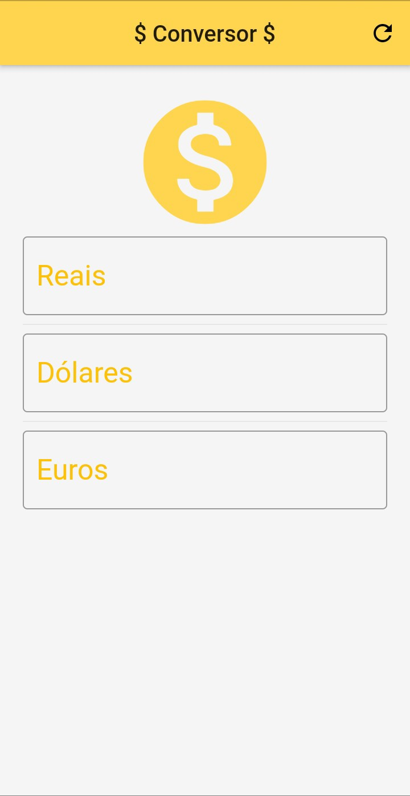

# Conversor de moedas

## Objetivo

Efetuar a conversão de moedas.

## Informações para conversão:

## Resultado:

Projeto realizado utilizando-se do framework Flutter, conforme demonstrado pelo prof. Daniel Ciolfi na plataforma Udemy.